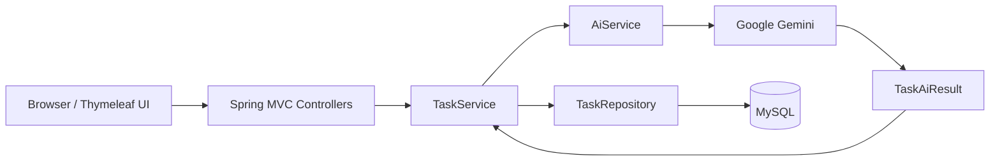

# SmartTask AI

> An AI-assisted task management application built with Spring Boot, Thymeleaf, Google Gemini, and MySQL.


SmartTask AI is a portfolio-ready task manager that combines conventional CRUD workflows with structured AI analysis. When a task is created, Google Gemini assigns a category and priority and generates a concise summary. A service-layer automation rule then decides whether the task should remain open or immediately require attention.

The project intentionally uses a straightforward layered architecture so the request flow, business rules, persistence, and AI integration remain easy to understand and explain.

## Highlights

- Complete task lifecycle: create, read, update, complete, and delete.
- AI-generated category, priority, and summary through Spring AI and Google Gemini.
- Structured Gemini responses mapped directly to a Java record.
- Safe fallback values when Gemini is unavailable, ensuring task creation still succeeds.
- Automatic escalation of `HIGH` priority tasks to `NEEDS_ATTENTION`.
- Dashboard metrics for total, open, high-priority, attention-required, and completed tasks.
- Server-side Jakarta Validation with user-friendly Thymeleaf error messages.
- Responsive Bootstrap interface with no frontend build system.
- Persistent MySQL runtime database managed through Docker Compose.
- Isolated H2 database for automated tests.
- Environment-based secret configuration for secrets and database overrides.

## Application flow



Task creation follows this sequence:

```text
Task form
   -> TaskController
   -> TaskService
   -> AiService
   -> Spring AI ChatClient
   -> Google Gemini
   -> TaskAiResult
   -> priority automation
   -> TaskRepository
   -> MySQL
```

If the AI provider fails, the service returns a deterministic fallback and the task is still persisted:

```text
category = General
priority = MEDIUM
summary  = AI analysis unavailable
status   = OPEN
```

## Technology stack

| Area | Technology |
| --- | --- |
| Language | Java 17 |
| Framework | Spring Boot 4.1.1 |
| Web | Spring MVC |
| View layer | Thymeleaf, HTML, CSS, Bootstrap |
| Persistence | Spring Data JPA, Hibernate |
| Runtime database | MySQL 8.4 |
| Test database | H2 |
| AI | Spring AI 2.0.1, Google Gemini `gemini-3.6-flash` |
| Validation | Jakarta Validation |
| Security | Spring Security dependency with default development authentication |
| Build | Maven Wrapper |
| Local infrastructure | Docker Compose |

## Core business rules

### AI analysis

Gemini receives the task title and description and returns:

```json
{
  "category": "Payment",
  "priority": "HIGH",
  "summary": "Customers cannot complete payments because the gateway is unavailable."
}
```

Priority is normalized to one of:

- `LOW`
- `MEDIUM`
- `HIGH`

Blank or invalid AI output is normalized before it reaches the database.

### Priority automation

```text
HIGH priority       -> NEEDS_ATTENTION
LOW/MEDIUM priority -> OPEN
```

Users can later mark any task as `COMPLETED`.

### Form validation

| Field | Rules |
| --- | --- |
| Title | Required; maximum 120 characters |
| Description | Required; maximum 2,000 characters |

Invalid forms remain on the same page, preserve entered values, display field-level errors, and do not call the create or update service operation.

## Project structure

```text
smarttask-ai/
├── docker-compose.yml
├── mvnw
├── mvnw.cmd
├── pom.xml
├── src/
│   ├── main/
│   │   ├── java/com/smarttask/smarttask_ai/
│   │   │   ├── SmarttaskAiApplication.java
│   │   │   ├── controller/
│   │   │   │   ├── DashboardController.java
│   │   │   │   └── TaskController.java
│   │   │   ├── dto/
│   │   │   │   └── TaskAiResult.java
│   │   │   ├── entity/
│   │   │   │   └── Task.java
│   │   │   ├── repository/
│   │   │   │   └── TaskRepository.java
│   │   │   └── service/
│   │   │       ├── AiService.java
│   │   │       └── TaskService.java
│   │   └── resources/
│   │       ├── static/css/style.css
│   │       ├── templates/
│   │       │   ├── dashboard.html
│   │       │   ├── task-details.html
│   │       │   ├── task-form.html
│   │       │   └── task-list.html
│   │       └── application.properties
│   └── test/
│       ├── java/com/smarttask/smarttask_ai/
│       │   ├── SmarttaskAiApplicationTests.java
│       │   ├── controller/TaskControllerTests.java
│       │   └── service/
│       │       ├── AiServiceTests.java
│       │       └── TaskServiceTests.java
│       └── resources/application.properties
└── README.md
```

## Data model

The `Task` entity stores both user-provided content and generated metadata:

| Field | Purpose |
| --- | --- |
| `id` | Database-generated task identifier |
| `title` | Short task title |
| `description` | Detailed task description |
| `category` | AI-generated business category |
| `priority` | AI-generated `LOW`, `MEDIUM`, or `HIGH` priority |
| `status` | `OPEN`, `NEEDS_ATTENTION`, or `COMPLETED` |
| `aiSummary` | Concise AI-generated summary |
| `createdAt` | Task creation timestamp |

## Getting started

### Prerequisites

Install the following tools:

- Java 17
- Docker Desktop with Docker Compose
- Git

Maven does not need to be installed globally because the repository includes the Maven Wrapper.

Verify the tools:

```bash
java --version
docker --version
docker compose version
```

### 1. Clone the repository

```bash
git clone <your-repository-url>
cd smarttask-ai
```

### 2. Configure local environment values

Create a `.env` file in the project root:

```properties
GOOGLE_API_KEY=your-google-gemini-api-key
DB_URL=jdbc:mysql://localhost:3306/smarttask?useSSL=false&allowPublicKeyRetrieval=true&serverTimezone=UTC
DB_USERNAME=root
DB_PASSWORD=the-password-configured-in-docker-compose.yml
```

Spring Boot imports this file through its native configuration system. The file is ignored by Git and must never be committed.

Environment variables can be used instead of `.env`; they override the defaults in `application.properties`.

| Variable | Purpose | Required for |
| --- | --- | --- |
| `GOOGLE_API_KEY` | Google Gemini API key | Live AI analysis |
| `DB_URL` | MySQL JDBC URL | Database override |
| `DB_USERNAME` | MySQL username | Database override |
| `DB_PASSWORD` | MySQL password | Database override |

### 3. Start MySQL

```bash
docker compose up -d
docker compose ps
```

Wait until `smarttask-mysql` reports `healthy`.

The Compose service creates:

- Container: `smarttask-mysql`
- Database: `smarttask`
- Persistent volume: `smarttask_mysql_data`
- MySQL port: `3306`

### 4. Run the application

Linux or macOS:

```bash
./mvnw spring-boot:run
```

Windows:

```powershell
mvnw.cmd spring-boot:run
```

Open [http://localhost:8080](http://localhost:8080).

Spring Security currently provides its default development login:

- Username: `user`
- Password: generated at startup and printed in the application console

Do not use the generated credentials as a production security configuration.

## Application routes

| Method | Route | Purpose |
| --- | --- | --- |
| `GET` | `/` | Dashboard summary |
| `GET` | `/tasks` | List all tasks |
| `GET` | `/tasks/new` | Display the create form |
| `POST` | `/tasks` | Validate and create a task |
| `GET` | `/tasks/{id}` | Display task details |
| `GET` | `/tasks/{id}/edit` | Display the edit form |
| `POST` | `/tasks/{id}` | Validate and update a task |
| `POST` | `/tasks/{id}/complete` | Mark a task completed |
| `POST` | `/tasks/{id}/delete` | Delete a task |

All state-changing browser actions use POST requests and Spring Security CSRF protection.

## Dashboard metrics

The landing page calculates its summaries with efficient repository count queries:

- Total Tasks
- Open Tasks
- High Priority Tasks
- Needs Attention
- Completed Tasks

## Testing

Automated tests use an in-memory H2 database and do not require Docker, MySQL, database credentials, or a real Gemini API key.

Run the test suite:

```bash
./mvnw test
```

Build the executable JAR and run all tests:

```bash
./mvnw package
```

The test suite covers:

- Spring application startup
- AI structured output and normalization
- AI failure fallback
- AI metadata assignment during creation
- Priority-to-status automation
- Task completion
- Dashboard count methods
- Create and edit validation
- Prevention of service calls for invalid forms

The packaged application is created at:

```text
target/smarttask-ai-0.0.1-SNAPSHOT.jar
```

Run it with:

```bash
java -jar target/smarttask-ai-0.0.1-SNAPSHOT.jar
```

## Database operations

View container status:

```bash
docker compose ps
```

View MySQL logs:

```bash
docker compose logs mysql
```

Open a MySQL shell:

```bash
docker exec -it smarttask-mysql mysql -uroot -p smarttask
```

Stop the database while preserving its data:

```bash
docker compose stop
```

Start it again:

```bash
docker compose start
```

Remove the container while preserving the named volume:

```bash
docker compose down
```

Avoid `docker compose down -v` unless you intentionally want to delete all SmartTask data.

## Port 3306 already in use

If another MySQL server already uses port `3306`, create a local `docker-compose.override.yml`:

```yaml
services:
  mysql:
    ports: !override
      - "3307:3306"
```

Then update the local `.env` file:

```properties
DB_URL=jdbc:mysql://localhost:3307/smarttask?useSSL=false&allowPublicKeyRetrieval=true&serverTimezone=UTC
```

The override file is ignored by Git, allowing each developer to choose a free local port without changing the shared Compose configuration.

## Troubleshooting

### MySQL container is not healthy

```bash
docker compose ps
docker compose logs mysql
```

Confirm Docker Desktop is running and the configured host port is available.

### Application cannot connect to MySQL

Confirm that:

1. `smarttask-mysql` is healthy.
2. `DB_URL` uses the same host port published by Docker Compose.
3. `DB_USERNAME` and `DB_PASSWORD` match the Compose configuration.
4. The `smarttask` database exists.

### AI analysis returns fallback values

Confirm that `GOOGLE_API_KEY` is present and valid for Google Gemini. AI failures intentionally do not prevent task creation; fallback metadata is stored instead.

### Port 8080 is already in use

Run the application on another port:

```bash
SERVER_PORT=8081 ./mvnw spring-boot:run
```

Then open [http://localhost:8081](http://localhost:8081).

## Design decisions

- **Layered architecture:** controllers handle web requests, services own business rules, and repositories handle persistence.
- **Constructor injection:** dependencies are explicit and classes remain simple to test.
- **Structured AI output:** `TaskAiResult` avoids parsing free-form AI text manually.
- **Graceful degradation:** an external AI outage cannot block task creation.
- **Derived repository methods:** Spring Data JPA generates CRUD and count queries without custom SQL.
- **Post/Redirect/Get:** successful form submissions redirect to avoid accidental duplicate submissions.
- **Separate test database:** H2 keeps tests fast and independent from local infrastructure.
- **No frontend framework:** Thymeleaf and Bootstrap keep the UI and build process lightweight.

## Current scope and roadmap

Implemented:

- Task CRUD workflow
- Responsive Thymeleaf UI
- Dashboard summaries
- Jakarta Validation
- Google Gemini integration through Spring AI
- AI fallback and priority automation
- MySQL persistence with Docker Compose
- H2-backed automated tests

Planned improvements:

- Custom Spring Security login and logout pages
- Application-specific users and `USER` authorization
- Broader controller and persistence test coverage
- Deployment documentation and production configuration

The roadmap intentionally avoids microservices, messaging platforms, workflow engines, and additional AI providers so the project remains focused and interview-friendly.

## Security notes

- Never commit `.env`, API keys, database passwords, or production credentials.
- Rotate any credential that has been shared publicly.
- Use deployment-platform secrets or environment variables outside local development.
- Replace Spring Security's generated development user before deploying the application.

---

Built as a focused demonstration of Spring Boot MVC, JPA persistence, server-rendered UI, structured AI integration, validation, testing, and resilient application design.
